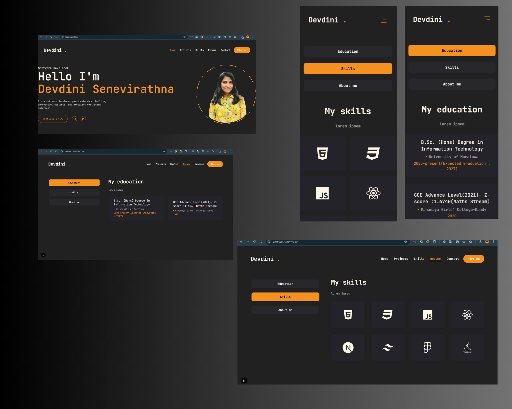
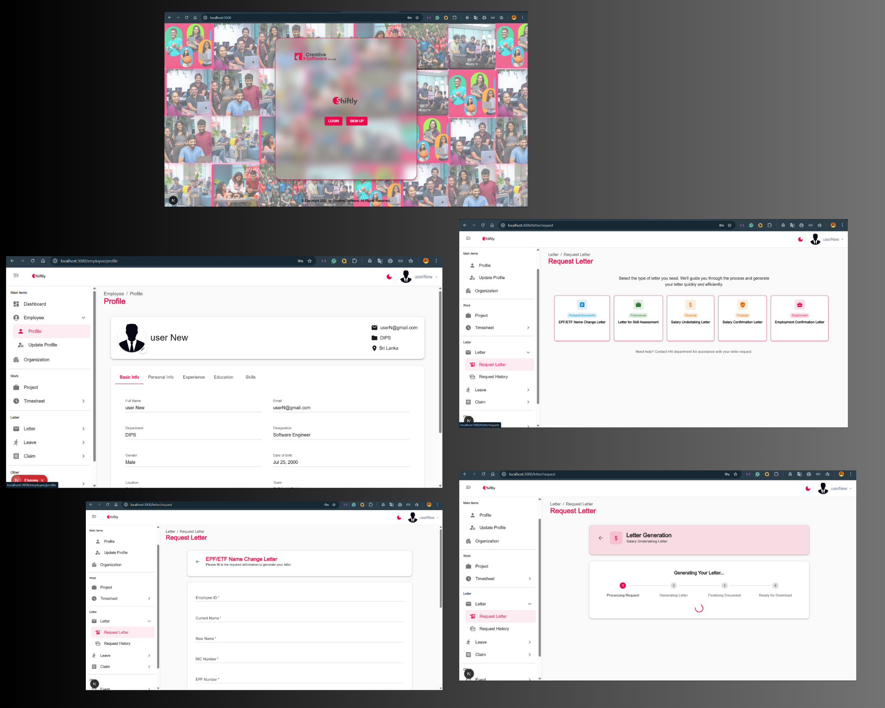
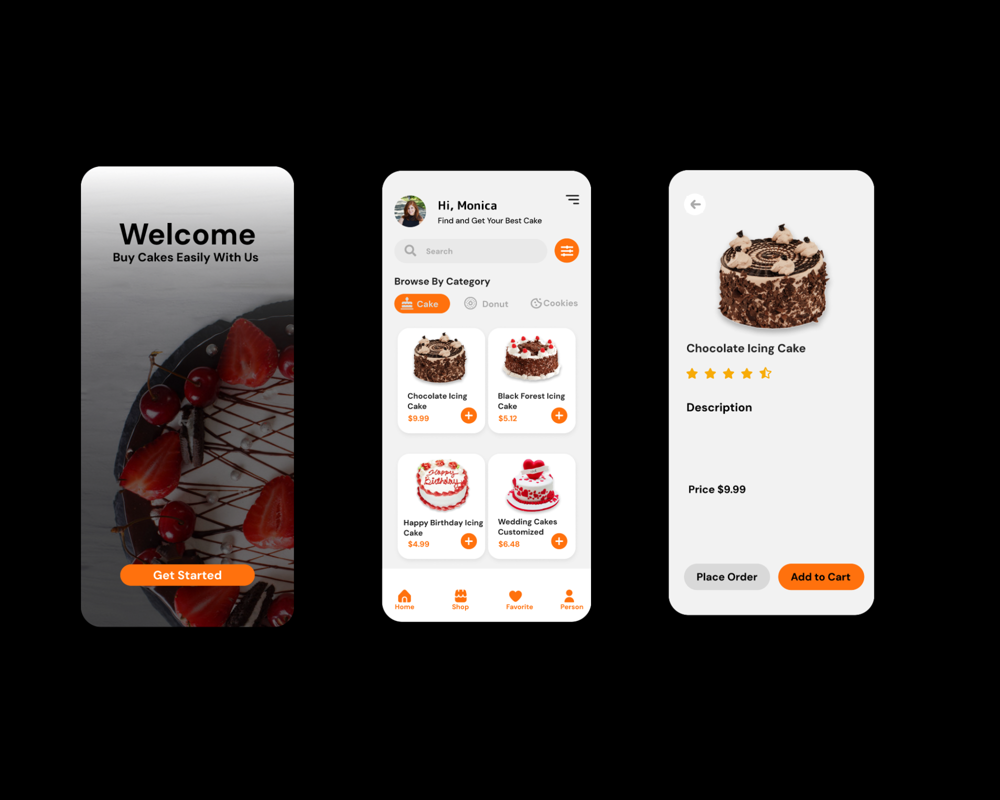

# 🚀 Devdini Senevirathna's Portfolio

> Welcome to my interactive portfolio! Explore my projects, skills, and experience, all built with Next.js and modern web technologies.

---

## 👤 About Me

Hi! I'm **Devdini Senevirathna**, a passionate web developer focused on building beautiful, performant, and accessible web applications. This portfolio showcases my journey, skills, and the projects I've crafted.

---

## ✨ Features

- **Modern UI/UX**: Clean, responsive design with smooth transitions and interactive elements.
- **Project Gallery**: Browse my highlighted projects with live previews and details.
- **Resume Download**: Instantly download my latest resume.
- **Contact Form**: Reach out to me directly from the site.
- **Mobile Friendly**: Optimized for all devices.

---

## 🛠️ Tech Stack

| Technology | Usage |
|------------|-------|
| [Next.js](https://nextjs.org/) | App framework |
| [React](https://react.dev/) | UI components |
| [Tailwind CSS](https://tailwindcss.com/) | Styling |
| [JavaScript](https://developer.mozilla.org/en-US/docs/Web/JavaScript) | Logic |
| [HTML5](https://developer.mozilla.org/en-US/docs/Web/Guide/HTML/HTML5) & [CSS3](https://developer.mozilla.org/en-US/docs/Web/CSS) | Markup & layout |

---

## 📂 Project Structure

```
my-portfolio/
├── app/           # Main app pages (Home, Projects, Resume, Contact)
├── assets/        # Images, icons, and SVGs
├── components/    # Reusable UI components
├── lib/           # Utility functions
├── public/        # Public assets (profile, resume)
├── ...            # Config and setup files
```

---

## 🚦 Getting Started

1. **Clone the repository:**
	```bash
	git clone https://github.com/DSenevirathna/my-portfolio.git
	cd my-portfolio
	```
2. **Install dependencies:**
	```bash
	npm install
	# or
	yarn install
	```
3. **Run the development server:**
	```bash
	npm run dev
	# or
	yarn dev
	```
4. **Open in your browser:**
	[http://localhost:3000](http://localhost:3000)

---

## 🖼️ Screenshots

<p align="center">
  
  
  
</p>

---

## 📄 Resume

- [Download my resume (PDF)](public/Devdini-Senevirathna.pdf)

---

## 📬 Contact

- **Email:** devdini.senevirathna@gmail.com
- **LinkedIn:** [linkedin.com/in/devdini-senevirathna](https://linkedin.com/in/devdini-senevirathna)
- **GitHub:** [github.com/DSenevirathna](https://github.com/DSenevirathna)

Or use the contact form on the website!

---

## 🌐 Live Demo

> [View Portfolio Live](https://my-portfolio-gold-eight-srax1mvnwq.vercel.app/) 

---

## 📝 License

This project is open source and available under the [MIT License](LICENSE).
